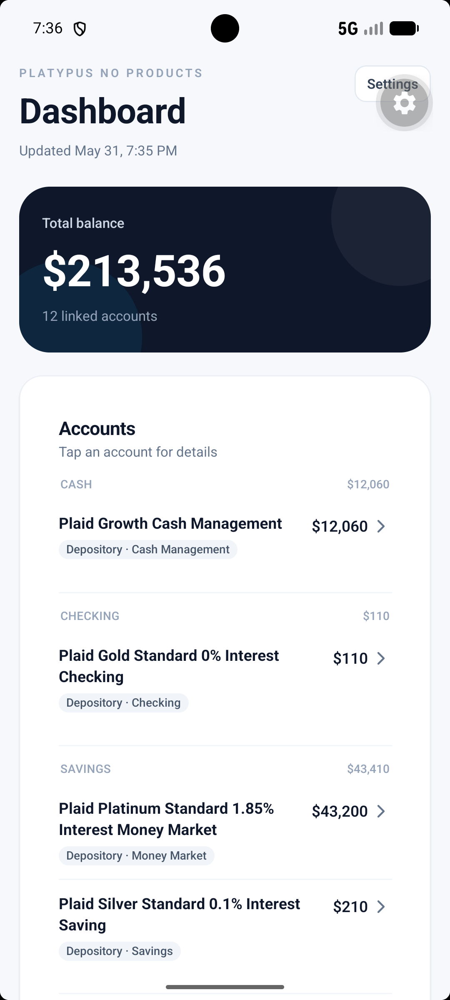
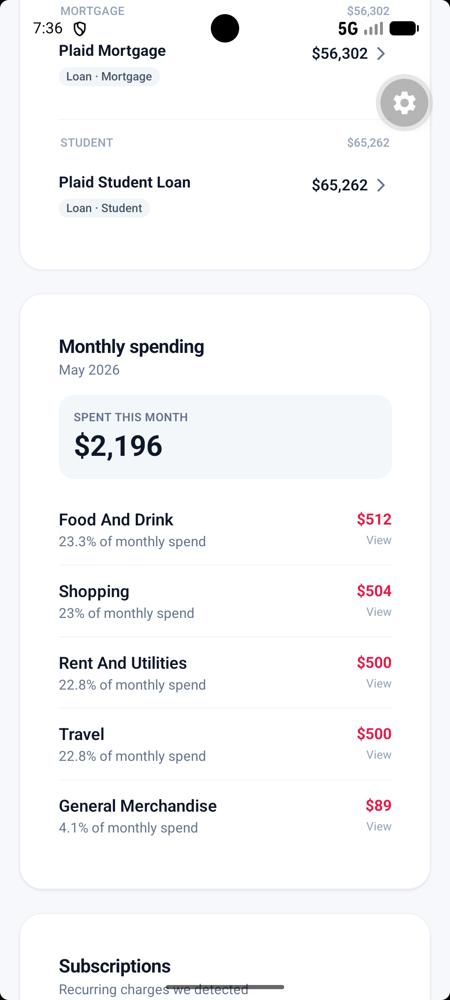
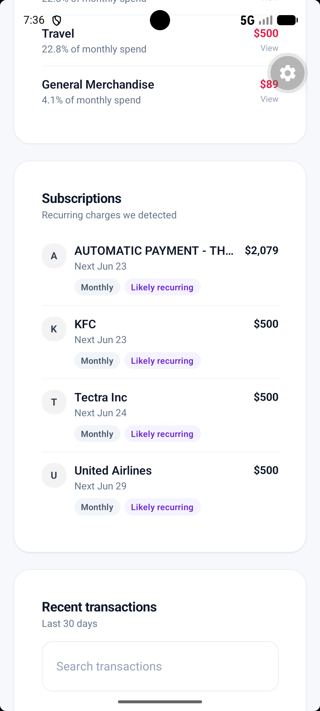
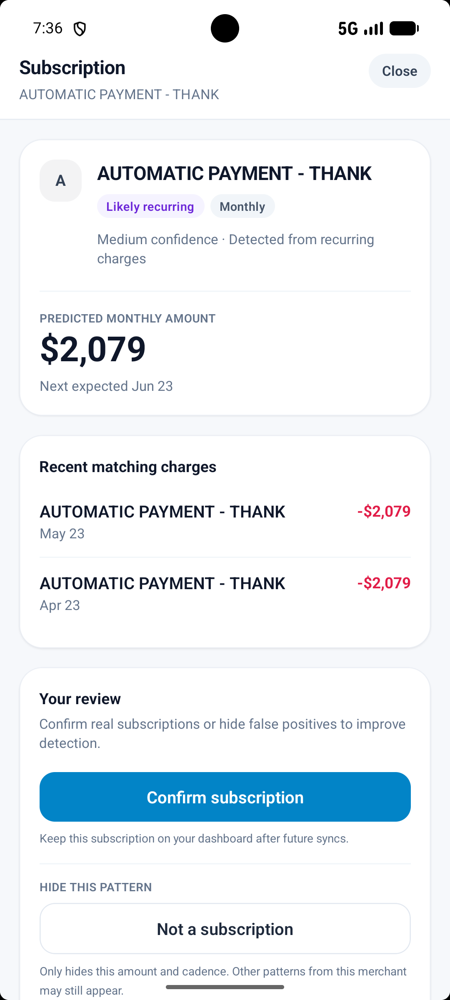
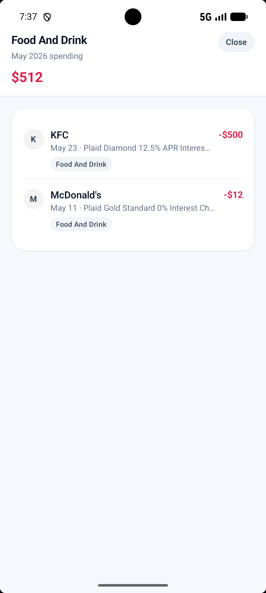

## Features

### Dashboard

* Consolidated account balances across linked financial institutions
* Monthly spending summary and category breakdowns
* Recent transaction feed with search functionality
* Local-first data storage

### Accounts

* Account grouping by type
* Detailed account views
* Balance tracking and institution organization

### Transactions

* Search and filter transactions
* Category drill-down views
* Manual category overrides
* Merchant-based categorization rules

### Subscription Detection

* Automatic recurring payment detection
* Subscription review workflow
* Predicted billing dates and amounts
* Confirm subscriptions or hide false positives

### Privacy-Focused Design

* Financial data stored locally in SQLite
* Plaid access tokens stored in Secure Store
* No analytics
* No cloud database
* No user tracking
* Minimal private Plaid proxy server

## Screenshots

### Dashboard Overview

### Monthly Spending Analysis

### Subscription Detection

### Subscription Review

### Category Drill Down

## Tech Stack

### Mobile

* React Native
* Expo
* TypeScript
* SQLite
* Expo Secure Store

### Backend

* Node.js
* Express
* Plaid API

## Portfolio Notes

This project was built to explore mobile application development, financial data aggregation, local-first architecture, transaction categorization, and recurring payment detection.

All financial account data shown in screenshots uses Plaid Sandbox test data.
